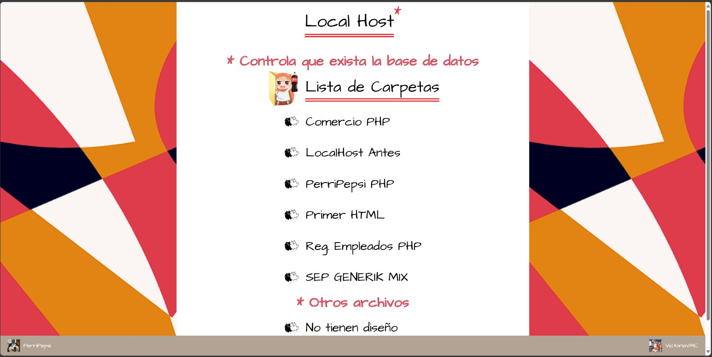
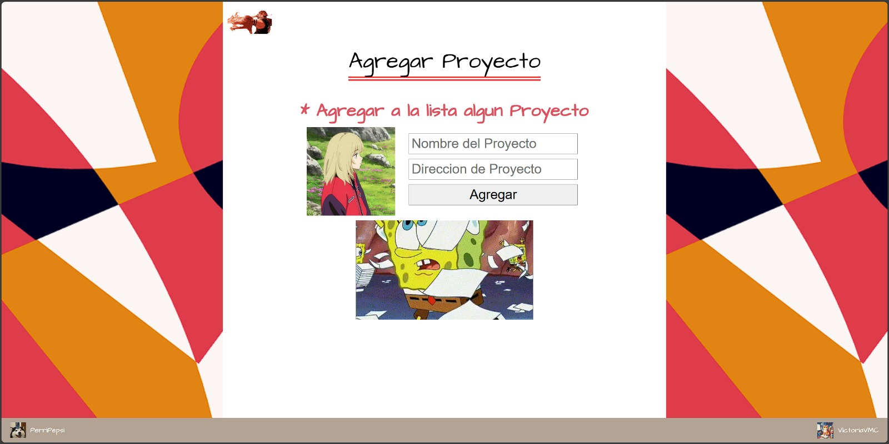

## LocalHost Diseño Visual Reutilizable!
- Este proyecto tiene como objetivo principal gestionar proyectos web de manera eficiente, permitiendo a los usuarios agregar, listar y acceder a diferentes proyectos a través de una interfaz web simple y funcional.
- Este proyecto facilita la gestión de proyectos web permitiendo una adición y visualización fácil de los mismos mediante una interfaz web. La estructura modular y el uso de plantillas hacen que sea fácil de mantener y expandir.

## Estructura del Proyecto
El proyecto está organizado en varias secciones y archivos que permiten su correcto funcionamiento.
La estructura y el propósito de cada uno es:
  - `head.php`: Incluye el contenido del <head> de las páginas HTML, con metadatos, enlaces a hojas de estilo.
  - `footer.php`: Incluye el pie de página común a todas las páginas del proyecto. Enlace mis datos de Github y un Canva donde tengo el diseño visual de todos los proyectos.
  - `volver.php`: Proporciona un enlace para regresar a la página index.

## Archivos Principales

# Mostrar Proyectos
La lista de proyectos se carga dinámicamente desde el archivo `carpetaArchivos.json` y se muestra en la página principal.
Cada proyecto se presenta como un enlace que dirige a la dirección especificada del proyecto.
 - `index.php`: Página principal que muestra la lista de proyectos. Que se encuentran dentro de la lista JSON.

# Agregar Proyecto
Un formulario permite ingresar el nombre y la dirección del proyecto. 
Al enviar el formulario, se procesa mediante el archivo `logica.php`.(En el Json se encarga de guardar el proyecto con la direccion base y al guardar se carga automatico al `index.php`)
 - `agregarArchivo.php`: Página para agregar un nuevo proyecto a la lista. Se guardara luego en el JSON.

## Lógica del Proyecto
Este bloque de código PHP se encarga de gestionar la lectura y escritura de un archivo JSON que contiene información sobre proyectos web.
- Lee el contenido del archivo `carpetaArchivos.json`, decodifica su contenido a un arreglo asociativo de PHP y verifica si la decodificación fue exitosa.
- Si la solicitud al servidor es de tipo GET y se reciben parámetros nombre y direccion, se agrega un nuevo proyecto al arreglo de proyectos. Luego, se ordena alfabéticamente el arreglo por clave (nombre del proyecto), se codifica de nuevo a formato JSON y se sobrescribe el archivo JSON original con los nuevos datos.
- Esta función muestra la lista de proyectos existentes, generando enlaces dinámicos para cada proyecto. Si no hay proyectos disponibles, muestra un mensaje indicando la ausencia de proyectos.
 - `logica.php`: Contiene las funciones PHP necesarias para manejar la lógica de agregar y mostrar proyectos.

# Lista de Proyectos

# Agregar Proyectos

